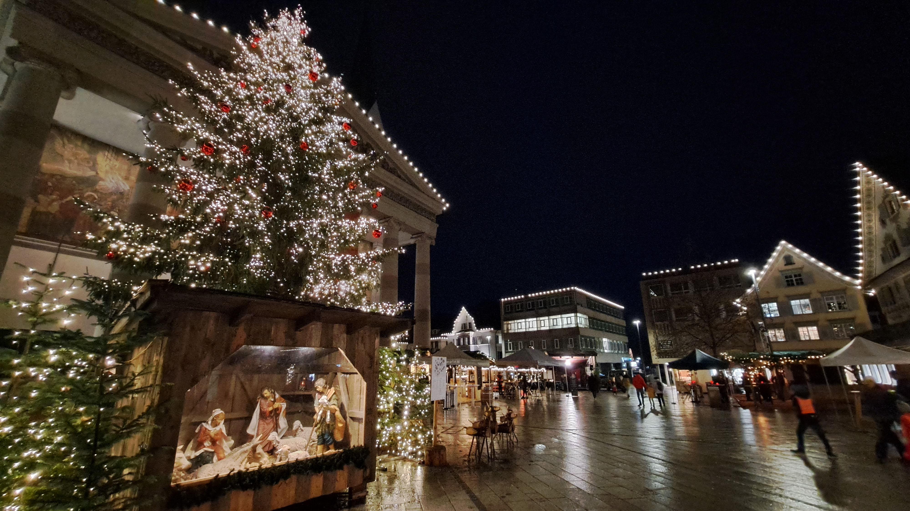

# PROFES2023に参加した話．

## 会議
PROFES2023に参加しました．
開催地はオーストリアのドルンビルンという片田舎でした．
日本からは移動だけで合計24時間ほどかかりました．
（途中で電車を間違えたりしていたので）

採択率がかなり高い会議で，Research Papersが40%程度，Short Papersがおよそ60%程度でした．
自分はResearch Papersの方で採録していただいていました．

前回国際会議に参加したのは，SCAM2022だったのですが，そちらと比べると雰囲気はかなり緩かった印象です．
特に，僕のセッションはチェアの方がかなり優しく，質疑応答で助けていただきました．

## 観光
会議場所の近くでクリスマスマーケットが開催されていたので，そちらにも寄ってみました．
ここで，観光客と思われる女性に話しかけられ，写真を撮ることになりました．
何とか意思疎通ができていることを感じ，自分の英語力に若干の自信がつきました．

